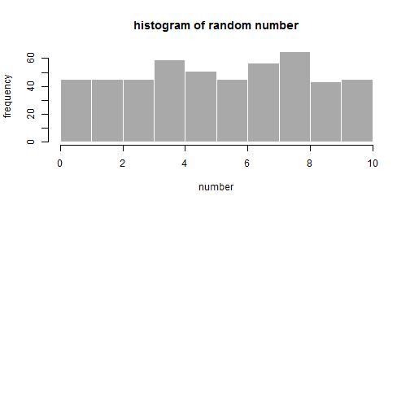

## Draw Number

With a box of numbers 1 to 10, we randomly draw a number with replacement from the box and repeat for 500 times.

Make the frequency plot (histogram) of each number, the distribution is __NOT__ normal.

--- 

## Draw N-sample of Number

With the same setting, we randomly draw (N=) 5 numbers (with replacement), then find the average. Repeat for 100 times. 

Make the frequency plot of each set of number average, the distribution become normal.

---

## Central Limit Theorem

Central Limit Theorem shows that the distribution of N-sample average becomes normal distribution, compared to individual drawing (NOT normal).

The theorem also has below properties:

1. The mean are the same as the population mean.

2. The standard deviation (sd) is 1/sqrt(N) of the population sd.

3. Normal distribution (Magic!!!)

For illustration apps:<https://twming.shinyapps.io/datascience-dataproducts/>

--- &radio
## Quiz

What is mean of N-sample draw?

1. twice of the population mean
2. _same as the population mean_
3. half of the population mean
4. no relation

*** .hint
It is the same set of number!

*** .explanation
Yes, Central Limit Theorem shows us they are the same as population mean!

